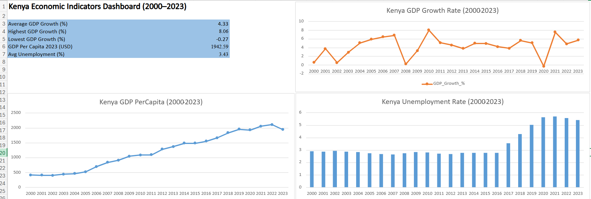

# Kenya Economic Indicators Analysis (2000–2023)

Analysis of Kenya's key economic indicators over 23 years using World Bank Open Data.

## Dashboard Preview

## Project Overview
This project analyses four economic indicators for Kenya from 2000 to 2023:
- GDP Growth Rate
- GDP Per Capita
- Unemployment Rate
- Poverty Headcount Ratio

## Tools Used
- **Microsoft Excel** — data cleaning and dashboard
- **Python** — data analysis and visualisation
- **Libraries:** pandas, matplotlib, seaborn

## Key Findings
- Kenya averaged **4.33% GDP growth** over 23 years
- **2020** was the only year of negative growth (-0.27%) due to COVID-19
- GDP per capita grew from **$414 to $1,943**, nearly a fivefold increase
- Unemployment nearly **doubled** from 2017 to 2021
- Poverty fell from 44.6% to 37.7% between 2005–2015 but **COVID reversed the gains**

## Data Source
[World Bank Open Data](https://data.worldbank.org/country/kenya)

## Analyst
**Euniter Kwamboka Bosire** | July 2026

